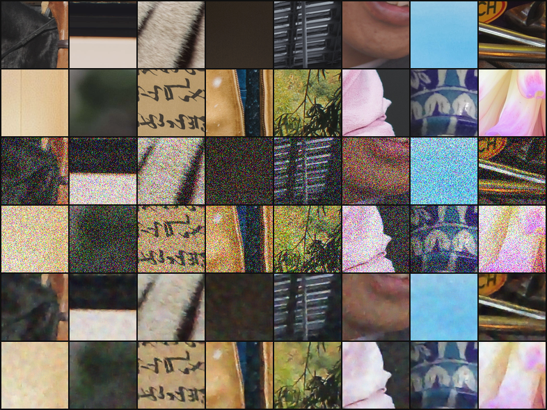
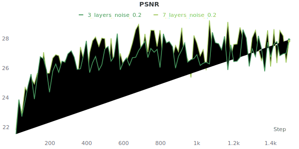

# Lab

 

## 1st Step
 Train a renset model (with 5-10 layers) on denoising task.
added a Gaussian noise with std equal to 0.2 to each image. 
I've added the ftn layer after each filter, In the first training alpha=0 (we dont learn the ftn blocks beacuse the gradient is 0).
the results were the same to the basic model (PSNR 27-28).

Clean Images During Training:

Noisy Images During Training:

Denoised Images During Training:

Test Image:

###Notes 
1. After 20 epochs the loss not converging (gets an error of 0.03 on L1 loss).
2. FTN layers initialized to identity (according to the paper).
3. The model has difficulty learning bigger noise  (#todo add an image of std 0.4 on 10 layers).

## 2nd Step

Finetune the model on Gaussian noise with std equal to [0.5, 0.6], alpha=1 while freezing
the weights of the model (beside the FTN layers, which responsible to learn the transition between the kernels on each noise),
At first the loss didn't converge, but after the initialization of the ftn kernel as idenety and the bias to zero the error has converged to a certain limit (which in my opinion is not good enough).

Clean Images During Training:
###todo add the figure in a row as svg and the psnr

Training on 0.2 noise          |  PSNR
:-------------------------:|:-------------------------:
  |  

  
  

[comment]: <> (
)

[comment]: <> ()

[comment]: <> (
)

[comment]: <> (Noisy Images During Training:)

[comment]: <> (
)

[comment]: <> ()

[comment]: <> (
)

[comment]: <> (Denoised Images During Training:)

[comment]: <> (
)

[comment]: <> ()

[comment]: <> (
)

###Notes:
- I think the model's architecture (resnet with blocks that contain filter, BN and relu) is not good enough, regardless of the number of layers of the model (I tried several layers and the difference is very negligible), it fails to bring good enough results in finetune. 
  I have read about a number of articles and may have tried to implement the DcNN model but I am not sure it will meet the conditions.

1. training first step on 0.1 std and finetuning the model on 0.5 std didnt work well. tha loss at start decreased.

#### todo add how 16 layers acts for big noise 

#### todo finetune add how it acts

### Interpolation

## Introduction
Deep convolutions neural network has demonstrated its capability of learning a deterministic mapping for the desired imagery effect. However, the large variety of user flavors motivates the possibility of continuous transition among different output effects.

For example if our task is image denoisng, the most common method is by supervised models (deep learning), when the input is a noisy image, and the output will be the clean image (fixed pre-determined corruption level). However, models are optimized for only a single degradation level, so if we have a batch of noisy images with different Gaussian noise, our model will not clean the images well (in reality, the degradation level is not known and at inference time, the model can under-perform). 

In order to overcome this limitation, continuous-level based models have been proposed. in such models, the output image is based on a target parameter which can be adjusted at inference time.

# Related Work

## Representation Learning

### Filter Transition Network - Smoother Network Tuning and Interpolation for Continuous-level Image Processing

- [paper](https://arxiv.org/abs/2010.02270)
- no code

Filter Transition Network (FTN) which is a non-linear module that easily adapts to new levels (and a method to initialize non- linear CNNs with identity mappings). 

FTN takes CNN filters as input (instead of image/feature map) and learns the transitions between levels (the modification is non-linear which can better adapt to new level). The FTN layer basically transform the filters of the network. 

### AdaFM - Modulating Image Restoration with Continual Levels via Adaptive Feature Modification Layers (CVPR 2019)

- [paper](https://arxiv.org/abs/1904.08118)
- [code](https://github.com/hejingwenhejingwen/AdaFM) 

- Main Idea:
The additional module, namely AdaFM layer, performs channel-wise feature modification, and can adapt a model to another restoration level with high accuracy. the aim is to add another layer to manipulate the statistics of the filters, so that they could be adapted to another restoration level.

Adaptive Feature Modification (AdaFM) layers are inspired by the recent normalization methods in deep CNNs, but in contrast AdaFM layer is independent of either batch or instance samples, filter size and position of AdaFM layers are flexible, the interpolation property of AdaFM layers could achieve continual modulation of restoration levels.

Because there are “high correlation” between the filters of the networks (as we saw in DNI), we can think of a function that performs the match between them those filters. To further reveal their relationship, they use a filter to bridge the corresponding filters - g (done by depth-wise convolution layer after each layer). 

In addition, the filter g is gradually updated by gradient descent, so we can obtain the intermediate filter to get smooth transition.

### DNI - Deep Network Interpolation for Continuous Imagery Effect Transition (CVPR 1028)

- [paper](https://arxiv.org/abs/1811.10515)
- [code](https://github.com/xinntao/DNI)

Continuous imagery effect transition is achieved via linear interpolation in the parameter space of existing trained networks. provided with a model for a particular effect A, they fine-tune it to realize another relevant effect B. DNI applies linear interpolation for all the corresponding parameters of these two deep networks (basically for the filters, normalization (IN) and the biases).

Network Interpolation:
If you train two models from scratch on the same task, and perform visualization of the filters (first and last filters), It can be seen that the order of the filters is different but their representation is similar (though not in the same order). Fine-tuning, however, can help to maintain the filters’s order and pattern. The “high correlation” between the parameters of these two networks provides the possibility for meaningful interpolation. 

In the image below it can be seen that the filters for different types of noise is strong correlated and when fine-tune several models for relevant tasks (different types of noise) from a pretrained one (N20), the correspondingly learned filters have intrinsic relations with a smooth transition, measuring the correlation between two filter (similar to the Pearson correlation) results close relationship among the learned filters, exhibiting a gradual change as the noise level increases. 

1.  הfinetune להראות החלקה של 
2. להראות החלקה של תמונה עם רעש 0.2
3. להראות את הloss בזמן הfinetune
4.  ולהראות תוצאות לחשב אינטפולציה
5. fix psnr
